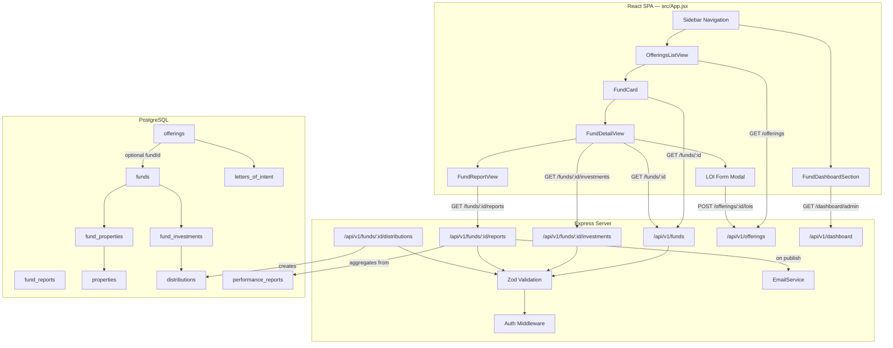
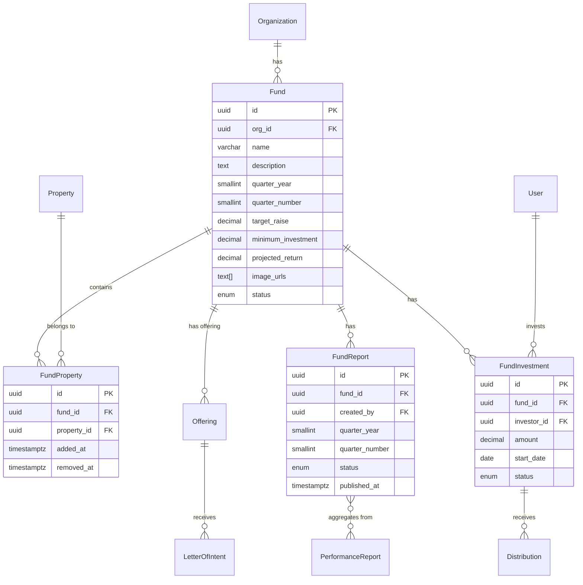

# Design Document: Fund Product

## Overview

The Fund Product feature adds a pooled investment vehicle to the Sonno Homes platform. A Fund groups multiple properties into a single product with quarterly reporting cycles. It integrates with the existing Offerings system — fund offerings appear alongside individual property offerings, reuse the LOI submission flow, and follow the same `draft → open → closed` lifecycle.

The implementation spans:
- **New Prisma models**: `Fund`, `FundProperty` (join table), `FundInvestment`, `FundReport`
- **New Express route file**: `server/src/routes/funds.ts` for fund CRUD, fund investments, fund reports, and fund distributions
- **Extended Offering model**: Add an optional `fundId` field so a fund can have an offering record, reusing the existing LOI flow
- **Frontend components**: `FundCard`, `FundDetailView`, `FundReportView`, `FundDashboardSection` added to `src/App.jsx`
- **Extended dashboard route**: Return fund-level KPIs alongside property metrics

Key design decisions:
1. **Fund offerings reuse the Offering model** — instead of a parallel offering system, a fund creates an Offering with `fundId` set (and `propertyId` nullable). This reuses the LOI form, LOI admin table, and email notifications without duplication.
2. **Fund reports compute aggregates at query time** (Requirement 8.5) — no pre-computed aggregate columns. The API queries constituent property reports and aggregates in the route handler.
3. **Fund distributions use the existing Distribution model** — linked through `FundInvestment` records, with `distType` set to `quarterly`.
4. **Single property per fund constraint** enforced via a unique index on `FundProperty` where the fund is active, plus application-level validation.

## Architecture



### Key Design Decisions

1. **Offering model extended with optional `fundId`** — A fund offering is an `Offering` row with `fundId` set and `propertyId` set to null. This lets fund offerings appear in the existing offerings list, reuse the LOI flow, and filter by product type via `fundId IS NULL` vs `fundId IS NOT NULL`.

2. **Separate `funds.ts` route file** — Fund CRUD, fund investments, fund reports, and fund distributions are all scoped under `/api/v1/funds`. The offerings route remains unchanged; it just includes fund offerings naturally.

3. **Aggregate metrics computed at query time** — Fund reports don't store pre-computed totals. The API fetches published property reports for the quarter, sums revenue/expenses, averages occupancy, and returns the result. This ensures data consistency per Requirement 8.5.

4. **FundInvestment is a separate model from Investment** — Fund investments track equity at the fund level, not per-property. The equity share is computed as `investorAmount / totalFundInvestments`. Distributions for fund investors are created via the existing `Distribution` model linked to `FundInvestment`.

5. **Property-to-fund uniqueness** — A property can belong to at most one active (non-closed) fund. Enforced by checking existing `FundProperty` records where the parent fund status is `draft` or `open`.

## Components and Interfaces

### Backend

#### Route: `server/src/routes/funds.ts`

| Method | Path | Auth | Description |
|--------|------|------|-------------|
| `POST` | `/api/v1/funds` | Admin | Create a new fund (status defaults to `draft`) |
| `GET` | `/api/v1/funds` | Admin | List all funds for the org |
| `GET` | `/api/v1/funds/:id` | Any authenticated | Get fund detail with constituent properties |
| `PATCH` | `/api/v1/funds/:id` | Admin | Update fund details or status |
| `DELETE` | `/api/v1/funds/:id` | Admin | Soft-delete fund (blocked if active investments) |
| `POST` | `/api/v1/funds/:id/properties` | Admin | Add properties to fund |
| `DELETE` | `/api/v1/funds/:id/properties/:propertyId` | Admin | Remove property from fund |
| `POST` | `/api/v1/funds/:id/investments` | Admin | Create fund investment |
| `GET` | `/api/v1/funds/:id/investments` | Admin | List fund investments with equity shares |
| `POST` | `/api/v1/funds/:id/reports` | Admin | Create/generate fund report for a quarter |
| `GET` | `/api/v1/funds/:id/reports` | Any authenticated | List fund reports |
| `GET` | `/api/v1/funds/:id/reports/:reportId` | Any authenticated | Get fund report detail with aggregates |
| `POST` | `/api/v1/funds/:id/reports/:reportId/publish` | Admin | Publish fund report and share with investors |
| `POST` | `/api/v1/funds/:id/distributions` | Admin | Create quarterly distributions for all fund investors |
| `GET` | `/api/v1/funds/:id/distributions` | Any authenticated | List fund distributions |

#### Extended Offering Model

The existing `Offering` model gets an optional `fundId` field. When creating a fund offering:
- `fundId` is set to the fund's ID
- `propertyId` becomes optional (null for fund offerings)
- The offerings list endpoint returns both types, with a `productType` computed field (`"fund"` or `"property"`)

#### Validation Schemas (added to `server/src/lib/validation.ts`)

```typescript
// Fund creation
export const createFundSchema = z.object({
  name: z.string().min(1).max(255),
  description: z.string().min(1),
  quarterYear: z.number().int().min(2020).max(2100),
  quarterNumber: z.number().int().min(1).max(4),
  targetRaise: z.number().min(0).optional(),
  minimumInvestment: z.number().min(0).optional(),
  projectedReturn: z.number().min(0).max(100).optional(),
  imageUrls: z.array(z.string().url()).max(5).optional(),
});

// Fund update
export const updateFundSchema = z.object({
  name: z.string().min(1).max(255).optional(),
  description: z.string().min(1).optional(),
  quarterYear: z.number().int().min(2020).max(2100).optional(),
  quarterNumber: z.number().int().min(1).max(4).optional(),
  targetRaise: z.number().min(0).optional(),
  minimumInvestment: z.number().min(0).optional(),
  projectedReturn: z.number().min(0).max(100).optional(),
  imageUrls: z.array(z.string().url()).max(5).optional(),
  status: z.enum(["draft", "open", "closed"]).optional(),
});

// Fund property assignment
export const addFundPropertiesSchema = z.object({
  propertyIds: z.array(z.string().uuid()).min(1),
});

// Fund investment creation
export const createFundInvestmentSchema = z.object({
  investorId: z.string().uuid(),
  amount: z.number().min(0),
  startDate: z.string().date(),
});

// Fund report creation
export const createFundReportSchema = z.object({
  quarterYear: z.number().int().min(2020).max(2100),
  quarterNumber: z.number().int().min(1).max(4),
});

// Fund distribution creation
export const createFundDistributionSchema = z.object({
  quarterYear: z.number().int().min(2020).max(2100),
  quarterNumber: z.number().int().min(1).max(4),
});
```


#### Email Service Extension

Add a `sendFundReportNotification` function to `server/src/lib/emailService.ts`:

```typescript
export interface FundReportNotificationPayload {
  fundName: string;
  quarterLabel: string; // e.g. "Q2 2025"
  investorEmails: string[];
}

export async function sendFundReportNotification(
  payload: FundReportNotificationPayload
): Promise<void>;
```

Follows the same fire-and-forget pattern as `sendLOINotification` — failures are logged, not surfaced.

### Frontend

#### New Components (in `src/App.jsx`)

| Component | Role |
|-----------|------|
| `FundCard` | Card showing fund name, property count, min investment, target raise, projected return, primary image, and "Fund" badge. Shows "Closed" badge when status is `closed`. |
| `FundDetailView` | Full fund detail: description, constituent properties list (name, location, type), investment terms, "Invest Now" button (hidden if closed). Admin sees management controls. |
| `FundReportView` | Displays aggregate fund metrics (total revenue, total expenses, avg occupancy, nights booked/available) and per-property breakdown table. |
| `FundDashboardSection` | Dashboard section showing fund AUM, active fund count, fund investor count. Investor view shows fund investment total, fund distributions received, fund ROI. |
| `FundFilterToggle` | Toggle/dropdown in OfferingsListView to filter by product type: All, Funds Only, Properties Only. |

#### API Client Additions (`src/api.js`)

```javascript
// ── Funds ───────────────────────────────────────────────────────────────────
export const fetchFunds = () => request("/api/v1/funds");
export const fetchFund = (id) => request(`/api/v1/funds/${id}`);
export const createFund = (body) => request("/api/v1/funds", { method: "POST", body });
export const updateFund = (id, body) => request(`/api/v1/funds/${id}`, { method: "PATCH", body });
export const addFundProperties = (id, body) =>
  request(`/api/v1/funds/${id}/properties`, { method: "POST", body });
export const removeFundProperty = (id, propertyId) =>
  request(`/api/v1/funds/${id}/properties/${propertyId}`, { method: "DELETE" });
export const fetchFundInvestments = (id) => request(`/api/v1/funds/${id}/investments`);
export const createFundInvestment = (id, body) =>
  request(`/api/v1/funds/${id}/investments`, { method: "POST", body });
export const fetchFundReports = (id) => request(`/api/v1/funds/${id}/reports`);
export const fetchFundReport = (id, reportId) =>
  request(`/api/v1/funds/${id}/reports/${reportId}`);
export const publishFundReport = (id, reportId) =>
  request(`/api/v1/funds/${id}/reports/${reportId}/publish`, { method: "POST" });
export const createFundReport = (id, body) =>
  request(`/api/v1/funds/${id}/reports`, { method: "POST", body });
export const createFundDistributions = (id, body) =>
  request(`/api/v1/funds/${id}/distributions`, { method: "POST", body });
export const fetchFundDistributions = (id) => request(`/api/v1/funds/${id}/distributions`);
```

#### Navigation Integration

No new sidebar entry needed — funds appear within the existing Offerings tab. The `OfferingsListView` gains a `FundFilterToggle` to filter by product type. Clicking a fund card navigates to `FundDetailView`.

Admin dashboard gets a new `FundDashboardSection` below existing metrics. Investor dashboard gets fund investment summary alongside property investments.

## Data Models

### New Prisma Enum

```prisma
enum FundStatus {
  draft
  open
  closed
}
```

### Fund Model

```prisma
model Fund {
  id                String     @id @default(uuid()) @db.Uuid
  orgId             String     @map("org_id") @db.Uuid
  name              String     @db.VarChar(255)
  description       String
  quarterYear       Int        @map("quarter_year") @db.SmallInt
  quarterNumber     Int        @map("quarter_number") @db.SmallInt
  targetRaise       Decimal?   @map("target_raise") @db.Decimal(14, 2)
  minimumInvestment Decimal?   @map("minimum_investment") @db.Decimal(14, 2)
  projectedReturn   Decimal?   @map("projected_return") @db.Decimal(5, 2)
  imageUrls         String[]   @map("image_urls")
  status            FundStatus @default(draft)
  createdAt         DateTime   @default(now()) @map("created_at") @db.Timestamptz()
  updatedAt         DateTime   @updatedAt @map("updated_at") @db.Timestamptz()
  deletedAt         DateTime?  @map("deleted_at") @db.Timestamptz()

  organization      Organization    @relation(fields: [orgId], references: [id])
  fundProperties    FundProperty[]
  fundInvestments   FundInvestment[]
  fundReports       FundReport[]
  offerings         Offering[]

  @@index([orgId], name: "idx_funds_org")
  @@index([status], name: "idx_funds_status")
  @@map("funds")
}
```

### FundProperty Model (Join Table)

```prisma
model FundProperty {
  id         String    @id @default(uuid()) @db.Uuid
  fundId     String    @map("fund_id") @db.Uuid
  propertyId String    @map("property_id") @db.Uuid
  addedAt    DateTime  @default(now()) @map("added_at") @db.Timestamptz()
  removedAt  DateTime? @map("removed_at") @db.Timestamptz()

  fund       Fund     @relation(fields: [fundId], references: [id])
  property   Property @relation(fields: [propertyId], references: [id])

  @@unique([fundId, propertyId], name: "uq_fund_property")
  @@index([fundId], name: "idx_fund_properties_fund")
  @@index([propertyId], name: "idx_fund_properties_property")
  @@map("fund_properties")
}
```

### FundInvestment Model

```prisma
model FundInvestment {
  id         String           @id @default(uuid()) @db.Uuid
  fundId     String           @map("fund_id") @db.Uuid
  investorId String           @map("investor_id") @db.Uuid
  amount     Decimal          @db.Decimal(14, 2)
  startDate  DateTime         @map("start_date") @db.Date
  status     InvestmentStatus @default(active)
  createdAt  DateTime         @default(now()) @map("created_at") @db.Timestamptz()
  updatedAt  DateTime         @updatedAt @map("updated_at") @db.Timestamptz()
  deletedAt  DateTime?        @map("deleted_at") @db.Timestamptz()

  fund          Fund           @relation(fields: [fundId], references: [id])
  investor      User           @relation(fields: [investorId], references: [id])
  distributions Distribution[]

  @@unique([fundId, investorId], name: "uq_fund_investment")
  @@index([fundId], name: "idx_fund_investments_fund")
  @@index([investorId], name: "idx_fund_investments_investor")
  @@index([status], name: "idx_fund_investments_status")
  @@map("fund_investments")
}
```

### FundReport Model

```prisma
model FundReport {
  id            String       @id @default(uuid()) @db.Uuid
  fundId        String       @map("fund_id") @db.Uuid
  createdBy     String       @map("created_by") @db.Uuid
  quarterYear   Int          @map("quarter_year") @db.SmallInt
  quarterNumber Int          @map("quarter_number") @db.SmallInt
  status        ReportStatus @default(draft)
  publishedAt   DateTime?    @map("published_at") @db.Timestamptz()
  notes         String?
  createdAt     DateTime     @default(now()) @map("created_at") @db.Timestamptz()
  updatedAt     DateTime     @updatedAt @map("updated_at") @db.Timestamptz()
  deletedAt     DateTime?    @map("deleted_at") @db.Timestamptz()

  fund          Fund         @relation(fields: [fundId], references: [id])
  creator       User         @relation("FundReportCreator", fields: [createdBy], references: [id])

  @@unique([fundId, quarterYear, quarterNumber], name: "uq_fund_report_quarter")
  @@index([fundId], name: "idx_fund_reports_fund")
  @@index([quarterYear, quarterNumber], name: "idx_fund_reports_quarter")
  @@map("fund_reports")
}
```

Note: `FundReport` stores no aggregate metric columns. All metrics (total revenue, total expenses, avg occupancy, etc.) are computed at query time from the underlying `PerformanceReport` records for constituent properties, per Requirement 8.5.

### Offering Model Extension

Add optional `fundId` to the existing `Offering` model and make `propertyId` optional:

```prisma
model Offering {
  // ... existing fields ...
  propertyId  String?  @map("property_id") @db.Uuid  // nullable for fund offerings
  fundId      String?  @map("fund_id") @db.Uuid      // set for fund offerings

  // ... existing relations ...
  fund        Fund?    @relation(fields: [fundId], references: [id])

  @@index([fundId], name: "idx_offerings_fund")
}
```

### Distribution Model Extension

Add optional `fundInvestmentId` to the existing `Distribution` model:

```prisma
model Distribution {
  // ... existing fields ...
  investmentId      String?  @map("investment_id") @db.Uuid  // nullable for fund distributions
  fundInvestmentId  String?  @map("fund_investment_id") @db.Uuid

  // ... existing relations ...
  fundInvestment    FundInvestment? @relation(fields: [fundInvestmentId], references: [id])

  @@index([fundInvestmentId], name: "idx_distributions_fund_investment")
}
```

### Relation Updates to Existing Models

- **Organization**: Add `funds Fund[]`
- **Property**: Add `fundProperties FundProperty[]`
- **User**: Add `fundInvestments FundInvestment[]`, `createdFundReports FundReport[] @relation("FundReportCreator")`

### Entity Relationship Diagram




## Correctness Properties

*A property is a characteristic or behavior that should hold true across all valid executions of a system — essentially, a formal statement about what the system should do. Properties serve as the bridge between human-readable specifications and machine-verifiable correctness guarantees.*

### Property 1: Fund creation produces a draft record

*For any* valid fund input (with name, description, quarterYear, quarterNumber), creating a fund should return a record with a unique UUID `id` and `status` equal to `draft`.

**Validates: Requirements 1.1, 1.4**

### Property 2: Required fields are enforced on fund creation

*For any* fund creation request missing at least one of the required fields (name, description, quarterYear, quarterNumber), the API should reject the request with a validation error.

**Validates: Requirements 1.2**

### Property 3: Optional fields are accepted on fund creation

*For any* valid fund input that includes any combination of optional fields (targetRaise, minimumInvestment, projectedReturn, imageUrls), the fund should be created successfully and the optional fields should be persisted.

**Validates: Requirements 1.3**

### Property 4: Property assignment links properties to fund

*For any* fund and any set of valid property IDs not already assigned to another active fund, assigning them should create FundProperty records, and a subsequent query of the fund should include those properties.

**Validates: Requirements 1.5**

### Property 5: Property uniqueness across active funds

*For any* property already assigned to an active (draft or open) fund, attempting to assign that property to a different active fund should be rejected with a validation error identifying the conflicting fund.

**Validates: Requirements 1.6, 8.4**

### Property 6: Fund update round-trip

*For any* existing fund and any valid partial update (name, description, targetRaise, etc.), the API should persist the changes and a subsequent GET should return the updated values.

**Validates: Requirements 1.7**

### Property 7: Open fund visibility

*For any* fund with status `open` that has an associated offering, the fund offering should appear in investor offering queries. Funds with status `draft` should not appear in investor queries.

**Validates: Requirements 1.8**

### Property 8: Closed fund reopen rejected

*For any* fund with status `closed`, attempting to change its status to `open` or `draft` should be rejected with a validation error.

**Validates: Requirements 1.10**

### Property 9: Fund card displays required information

*For any* fund data, the rendered fund card should contain the fund name, number of constituent properties, minimum investment, target raise, projected return, and a primary image.

**Validates: Requirements 2.2**

### Property 10: Closed fund card shows badge and hides Invest Now

*For any* fund with status `closed`, the rendered card should display a "Closed" badge and the "Invest Now" button should not be present.

**Validates: Requirements 2.7**

### Property 11: Fund LOI creation on open offering

*For any* open fund offering and any valid LOI input (with intendedAmount >= fund's minimumInvestment and signatureAcknowledged = true), the API should create an LOI record with status `submitted` linked to the fund offering.

**Validates: Requirements 2.5**

### Property 12: LOI amount below fund minimum is rejected

*For any* fund offering with minimumInvestment M and any intendedAmount < M, the LOI submission should be rejected with a validation error specifying the minimum amount.

**Validates: Requirements 2.6**

### Property 13: Fund investment creation on open fund

*For any* open fund and valid investment input (investorId, amount, startDate), creating a fund investment should produce a FundInvestment record. For any fund with status other than `open`, the request should be rejected.

**Validates: Requirements 3.1, 3.3**

### Property 14: Required fields enforced on fund investment creation

*For any* fund investment creation request missing at least one of the required fields (investorId, amount, startDate), the API should reject the request with a validation error.

**Validates: Requirements 3.2**

### Property 15: Equity share computation

*For any* fund with one or more investments, each investor's equity share should equal their investment amount divided by the total fund investment amount. The sum of all equity shares should equal 1.0 (within floating-point tolerance).

**Validates: Requirements 3.4**

### Property 16: Mixed investment list includes product type labels

*For any* investor with both fund investments and property investments, the investments list API should return both types, each with a `productType` field distinguishing them.

**Validates: Requirements 3.5**

### Property 17: Fund report aggregation correctness

*For any* fund with N constituent properties that have published reports for a given quarter, the fund report aggregate metrics should satisfy: totalGrossRevenue = sum of all property grossRevenue values, totalExpenses = sum of all property totalExpenses values, averageOccupancy = mean of all property occupancy rates, totalNightsBooked = sum of all property nightsBooked, totalNightsAvailable = sum of all property nightsAvailable. If the underlying property reports are updated, the fund report data should reflect the changes on next query.

**Validates: Requirements 4.1, 4.2, 8.5**

### Property 18: Fund management fee computation

*For any* fund report, the management fee should equal (totalGrossRevenue - totalExpenses) * organization.managementFee rate.

**Validates: Requirements 4.3**

### Property 19: Missing property reports produce warnings

*For any* fund where some constituent properties lack published reports for the specified quarter, the fund report creation response should include a warnings array listing the properties with missing reports, and the aggregation should proceed with available data only.

**Validates: Requirements 4.4**

### Property 20: Fund report publish shares with investors

*For any* draft fund report, publishing should set status to `published`, set `publishedAt` to a non-null timestamp, and create document recipient records for all active fund investors.

**Validates: Requirements 4.5**

### Property 21: Per-property breakdown in fund report

*For any* fund report, the response should include a per-property breakdown array where each entry contains the property's individual revenue, expenses, and occupancy for the quarter.

**Validates: Requirements 4.6**

### Property 22: Fund distribution creates records for all active investors

*For any* fund with N active investors and a published fund report for the quarter, creating a fund distribution should produce exactly N distribution records, each with `distType` set to `quarterly`.

**Validates: Requirements 5.1, 5.3**

### Property 23: Fund distribution amount computation

*For any* fund distribution, each investor's distribution amount should equal the fund's net profit for the quarter multiplied by the investor's equity share (investorAmount / totalFundAmount).

**Validates: Requirements 5.2**

### Property 24: Fund distribution requires published report

*For any* fund and quarter without a published fund report, attempting to create a fund distribution should be rejected with a validation error.

**Validates: Requirements 5.4**

### Property 25: Mixed distribution list includes product type labels

*For any* investor with both fund distributions and property distributions, the distributions list should return both types, each labeled with the source product type and fund name.

**Validates: Requirements 5.5**

### Property 26: Fund dashboard metrics correctness

*For any* set of funds and fund investments, the admin dashboard should return: totalFundAUM = sum of all active fund investment amounts, activeFundCount = count of funds with status `open`, fundInvestorCount = count of distinct investors with active fund investments.

**Validates: Requirements 6.1**

### Property 27: Investor fund dashboard metrics

*For any* investor with fund investments, the investor dashboard should include totalFundInvested, totalFundDistributions, and fundROI = totalFundDistributions / totalFundInvested * 100.

**Validates: Requirements 6.3**

### Property 28: Fund product type label on all fund components

*For any* fund-related rendered component (card, detail view, list item), the output should contain a "Fund" product type label.

**Validates: Requirements 7.1**

### Property 29: Offering filter by product type

*For any* mixed set of fund offerings and property offerings, filtering by "funds" should return only offerings with a non-null fundId, and filtering by "properties" should return only offerings with a null fundId.

**Validates: Requirements 7.2**

### Property 30: Fund detail view shows constituent properties

*For any* fund with constituent properties, the detail view should list each property with its name, location, and property type.

**Validates: Requirements 7.3**

### Property 31: Removed properties excluded from future aggregations

*For any* fund where a property has been removed (removedAt set) or soft-deleted (property.deletedAt set), future fund report aggregations should exclude that property's data, while previously published fund reports should remain unchanged.

**Validates: Requirements 8.1, 8.2**

### Property 32: Fund with active investments cannot be deleted

*For any* fund with at least one active FundInvestment record, attempting to delete the fund should be rejected with an error indicating active investments exist.

**Validates: Requirements 8.3**

## Error Handling

### API Error Responses

All errors follow the existing `AppError` pattern with structured JSON responses:

```json
{
  "success": false,
  "error": {
    "code": "VALIDATION_ERROR",
    "message": "Description of the error"
  }
}
```

| Scenario | Status Code | Error Code | Message |
|----------|-------------|------------|---------|
| Missing required fund fields | 400 | `VALIDATION_ERROR` | Zod validation message |
| Property already in active fund | 400 | `VALIDATION_ERROR` | "Property '{name}' already belongs to fund '{fundName}'" |
| Closed fund reopen attempt | 400 | `VALIDATION_ERROR` | "Closed funds cannot be reopened" |
| Investment on non-open fund | 400 | `VALIDATION_ERROR` | "Fund is not currently accepting investments" |
| LOI amount below fund minimum | 400 | `VALIDATION_ERROR` | "Intended amount must be at least {minimumInvestment}" |
| Distribution without published report | 400 | `VALIDATION_ERROR` | "No published fund report exists for Q{n} {year}" |
| Delete fund with active investments | 400 | `VALIDATION_ERROR` | "Cannot delete fund with active investments" |
| Fund not found | 404 | `NOT_FOUND` | "Fund with id '{id}' not found" |
| Fund report not found | 404 | `NOT_FOUND` | "FundReport with id '{id}' not found" |
| Investor attempts admin action | 403 | `FORBIDDEN` | "You do not have permission to perform this action" |
| Unauthenticated request | 401 | `UNAUTHORIZED` | "Authentication required" |

### Fund Report Warnings (non-blocking)

When creating a fund report with missing property reports, the API returns a success response with a `warnings` array:

```json
{
  "success": true,
  "data": { ... },
  "warnings": [
    "Property 'Beach Villa' has no published report for Q2 2025",
    "Property 'Mountain Lodge' has no published report for Q2 2025"
  ]
}
```

### Email Notification Error Handling

Fund report publication email notifications follow the same fire-and-forget pattern as LOI notifications:
- Failures are caught in a try/catch and logged via `console.error`
- The publish operation succeeds regardless of email delivery
- No retry mechanism in v1

### Frontend Error Handling

- API errors displayed as inline messages near the relevant form/action
- Network errors show a generic "Something went wrong" message with retry
- Form validation errors shown inline next to the relevant field
- Loading states during API calls to prevent double-submission
- Fund report warnings displayed as dismissible info banners

## Testing Strategy

### Unit Tests

Unit tests cover specific examples, edge cases, and integration points:

- **Fund creation**: Verify a specific valid fund is created with correct defaults
- **Status transitions**: Test each valid transition (draft→open, open→closed) and each invalid transition (closed→open, closed→draft)
- **Property assignment**: Test assigning a property, then attempting to assign the same property to another fund
- **Fund report aggregation**: Test with a specific set of property reports and verify exact aggregate values
- **Management fee calculation**: Test with known revenue, expenses, and fee rate
- **Equity share computation**: Test with 3 investors with known amounts, verify shares
- **Distribution calculation**: Test with known net profit and equity shares
- **Edge cases**: Fund with 0 properties, fund report with all properties missing reports, fund with single investor (100% equity), distribution with 0 net profit

### Property-Based Tests

Property-based tests verify universal properties across randomized inputs. Use `fast-check` as the PBT library.

**Configuration**:
- Each property test runs a minimum of 100 iterations
- Each test is tagged with a comment referencing the design property
- Tag format: `Feature: fund-product, Property {number}: {property_text}`
- Each correctness property is implemented by a single property-based test

**Backend property tests** (`server/src/__tests__/funds.property.test.ts`):
- Property 1: Generate random valid fund data → verify creation returns draft status with UUID
- Property 2: Generate random subsets of required fields with at least one missing → verify rejection
- Property 5: Generate two funds and a property → assign to first, attempt assign to second → verify rejection
- Property 6: Generate random fund and partial updates → verify round-trip
- Property 8: Generate random closed funds → verify reopen rejected
- Property 13: Generate random fund investment data for open vs non-open funds → verify acceptance/rejection
- Property 15: Generate random sets of fund investments → verify equity shares sum to 1.0
- Property 17: Generate random property reports for fund constituents → verify aggregate computation
- Property 18: Generate random revenue, expenses, fee rate → verify management fee
- Property 19: Generate funds with partial property report coverage → verify warnings
- Property 20: Generate draft fund reports → verify publish sets status, timestamp, and shares with investors
- Property 22: Generate funds with N investors → verify N distribution records created with quarterly type
- Property 23: Generate random net profit and investor amounts → verify distribution amounts
- Property 24: Generate funds without published reports → verify distribution creation rejected
- Property 26: Generate random fund data → verify dashboard AUM, active count, investor count
- Property 31: Generate funds, remove a property, verify future aggregation excludes it
- Property 32: Generate funds with active investments → verify deletion rejected

**Frontend property tests** (`src/__tests__/funds.property.test.jsx`):
- Property 9: Generate random fund data → verify card renders all required fields
- Property 10: Generate random closed funds → verify badge shown and Invest Now hidden
- Property 28: Generate random fund components → verify "Fund" label present
- Property 29: Generate mixed offerings → verify filter returns correct subset
- Property 30: Generate funds with properties → verify detail view lists properties with name, location, type

Unit tests complement property tests by covering specific examples and edge cases that benefit from concrete, readable assertions.
