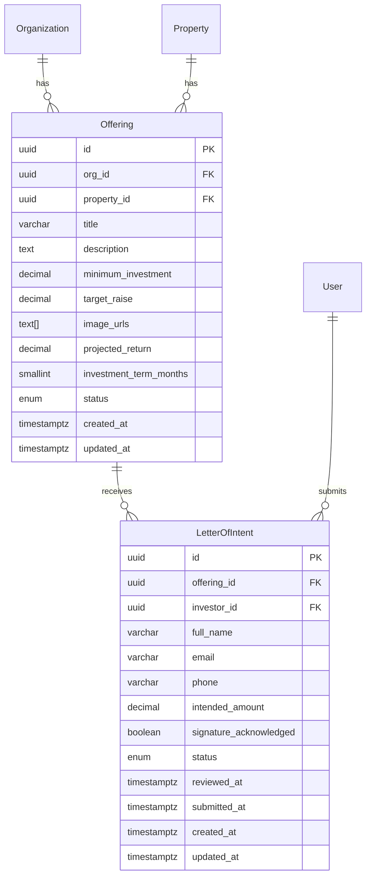

# Design Document: Offerings Tab

## Overview

The Offerings Tab adds a new section to the Sonno Homes platform where admins publish investment offerings tied to properties, and investors browse them and submit Letters of Intent (LOI). The feature spans the full stack: two new Prisma models (`Offering`, `LetterOfIntent`), new Express API routes for CRUD and LOI management, a lightweight email notification service, and React frontend components integrated into the existing single-file SPA.

The design follows the established patterns in the codebase: Express Router + Zod validation + Prisma ORM on the backend, and inline-styled React components with the existing `DataContext` pattern on the frontend.

## Architecture

```mermaid
graph TD
    subgraph Frontend [React SPA - src/App.jsx]
        Nav[Sidebar Navigation]
        OL[OfferingsList]
        OD[OfferingDetail]
        LOIForm[LOI Form Modal]
        AdminLOI[Admin LOI Tracker]
    end

    subgraph Backend [Express Server]
        OR[/api/v1/offerings]
        LOIR[/api/v1/offerings/:id/lois]
        Val[Zod Validation]
        Auth[Auth Middleware]
        Email[EmailService]
    end

    subgraph Database [PostgreSQL]
        OfferingTable[offerings]
        LOITable[letters_of_intent]
        PropTable[properties]
        UserTable[users]
    end

    Nav --> OL
    OL --> OD
    OD --> LOIForm
    OD --> AdminLOI

    OL -->|GET /offerings| OR
    OD -->|GET /offerings/:id| OR
    LOIForm -->|POST /offerings/:id/lois| LOIR
    AdminLOI -->|GET /offerings/:id/lois| LOIR

    OR --> Val --> Auth
    LOIR --> Val --> Auth

    OR --> OfferingTable
    LOIR --> LOITable
    OfferingTable --> PropTable
    LOITable --> OfferingTable
    LOITable --> UserTable

    LOIR -->|on LOI create| Email
```

### Key Design Decisions

1. **LOI routes nested under offerings** (`/offerings/:id/lois`) — LOIs are always scoped to an offering, so nesting keeps the API intuitive and simplifies authorization.
2. **Email service as a fire-and-forget utility** — LOI creation succeeds even if email fails. Failures are logged, not surfaced to the investor.
3. **Single route file** — Both offering and LOI routes live in `server/src/routes/offerings.ts` since LOIs are tightly coupled to offerings.
4. **No separate frontend files** — Components are added to `src/App.jsx` following the existing pattern. Data fetching goes through `src/api.js` and `src/DataContext.jsx`.

## Components and Interfaces

### Backend

#### Route: `server/src/routes/offerings.ts`

| Method | Path | Auth | Description |
|--------|------|------|-------------|
| `GET` | `/api/v1/offerings` | Any authenticated | List offerings (investors see `open` only; admins see all) |
| `GET` | `/api/v1/offerings/:id` | Any authenticated | Get offering detail with property info |
| `POST` | `/api/v1/offerings` | Admin | Create a new offering (status defaults to `draft`) |
| `PATCH` | `/api/v1/offerings/:id` | Admin | Update offering fields or status |
| `GET` | `/api/v1/offerings/:id/lois` | Admin | List LOIs for an offering |
| `POST` | `/api/v1/offerings/:id/lois` | Investor | Submit an LOI for an offering |
| `PATCH` | `/api/v1/offerings/:id/lois/:loiId` | Admin | Update LOI status (e.g., mark as `reviewed`) |

#### Validation Schemas (added to `server/src/lib/validation.ts`)

```typescript
// Offering creation
export const createOfferingSchema = z.object({
  propertyId: z.string().uuid(),
  title: z.string().min(1).max(255),
  description: z.string().min(1),
  minimumInvestment: z.number().min(0),
  targetRaise: z.number().min(0),
  imageUrls: z.array(z.string().url()).max(5).optional(),
  projectedReturn: z.number().min(0).max(100).optional(),
  investmentTermMonths: z.number().int().min(1).optional(),
});

// Offering update (partial, plus status transitions)
export const updateOfferingSchema = z.object({
  title: z.string().min(1).max(255).optional(),
  description: z.string().min(1).optional(),
  minimumInvestment: z.number().min(0).optional(),
  targetRaise: z.number().min(0).optional(),
  imageUrls: z.array(z.string().url()).max(5).optional(),
  projectedReturn: z.number().min(0).max(100).optional(),
  investmentTermMonths: z.number().int().min(1).optional(),
  status: z.enum(["draft", "open", "funded"]).optional(),
});

// LOI submission
export const createLOISchema = z.object({
  fullName: z.string().min(1).max(255),
  email: z.string().email(),
  phone: z.string().min(1).max(50),
  intendedAmount: z.number().min(0),
  signatureAcknowledged: z.literal(true),
});

// LOI status update
export const updateLOISchema = z.object({
  status: z.enum(["submitted", "reviewed", "withdrawn"]),
});
```

#### Email Service: `server/src/lib/emailService.ts`

A minimal service that sends LOI notification emails to org admins. Uses `nodemailer` (or a similar transport). In dev mode, logs to console instead of sending.

```typescript
interface LOINotificationPayload {
  investorName: string;
  offeringTitle: string;
  intendedAmount: number;
  submittedAt: Date;
  adminEmails: string[];
}

export async function sendLOINotification(payload: LOINotificationPayload): Promise<void>;
```

### Frontend

#### New Components (in `src/App.jsx`)

| Component | Role |
|-----------|------|
| `OfferingCard` | Card displaying offering summary (image, title, property, min investment, target raise, projected return). Shows "Fully Funded" badge when status is `funded`. |
| `OfferingsListView` | Grid of `OfferingCard` components. Admin sees a "Create Offering" button. |
| `OfferingDetailView` | Full offering detail with image gallery, description, terms. Investor sees "Invest Now" button (hidden if funded). Admin sees LOI summary and list. |
| `LOIFormModal` | Modal form for LOI submission: full name, email, phone, intended amount, signature checkbox. Client-side validation before submit. |
| `AdminLOITable` | Table of LOI submissions for an offering, showing investor name, email, phone, amount, date, status. Displays summary counts at top. |

#### API Client Additions (`src/api.js`)

```javascript
export const fetchOfferings = (role = "admin") =>
  request("/api/v1/offerings", { role });
export const fetchOffering = (id) =>
  request(`/api/v1/offerings/${id}`);
export const createOffering = (body) =>
  request("/api/v1/offerings", { method: "POST", body });
export const updateOffering = (id, body) =>
  request(`/api/v1/offerings/${id}`, { method: "PATCH", body });
export const fetchOfferingLOIs = (offeringId) =>
  request(`/api/v1/offerings/${offeringId}/lois`);
export const submitLOI = (offeringId, body) =>
  request(`/api/v1/offerings/${offeringId}/lois`, { method: "POST", body, role: "investor" });
export const updateLOIStatus = (offeringId, loiId, body) =>
  request(`/api/v1/offerings/${offeringId}/lois/${loiId}`, { method: "PATCH", body });
```

#### Navigation Integration

Add an "Offerings" entry to both `adminNav` and `investorNav` arrays in the `SonnoHomes` component:

```javascript
{ id: "offerings", label: "Offerings", icon: "📋" }
```

The active view state (`activeView`) will route to `OfferingsListView` when `"offerings"` is selected, and to `OfferingDetailView` when a specific offering is clicked.

## Data Models

### New Prisma Enums

```prisma
enum OfferingStatus {
  draft
  open
  funded
}

enum LOIStatus {
  submitted
  reviewed
  withdrawn
}
```

### Offering Model

```prisma
model Offering {
  id                   String         @id @default(uuid()) @db.Uuid
  orgId                String         @map("org_id") @db.Uuid
  propertyId           String         @map("property_id") @db.Uuid
  title                String         @db.VarChar(255)
  description          String
  minimumInvestment    Decimal        @map("minimum_investment") @db.Decimal(14, 2)
  targetRaise          Decimal        @map("target_raise") @db.Decimal(14, 2)
  imageUrls            String[]       @map("image_urls")
  projectedReturn      Decimal?       @map("projected_return") @db.Decimal(5, 2)
  investmentTermMonths Int?           @map("investment_term_months") @db.SmallInt
  status               OfferingStatus @default(draft)
  createdAt            DateTime       @default(now()) @map("created_at") @db.Timestamptz()
  updatedAt            DateTime       @updatedAt @map("updated_at") @db.Timestamptz()

  organization         Organization   @relation(fields: [orgId], references: [id])
  property             Property       @relation(fields: [propertyId], references: [id])
  lettersOfIntent      LetterOfIntent[]

  @@index([orgId], name: "idx_offerings_org")
  @@index([propertyId], name: "idx_offerings_property")
  @@index([status], name: "idx_offerings_status")
  @@map("offerings")
}
```

### LetterOfIntent Model

```prisma
model LetterOfIntent {
  id                     String    @id @default(uuid()) @db.Uuid
  offeringId             String    @map("offering_id") @db.Uuid
  investorId             String    @map("investor_id") @db.Uuid
  fullName               String    @map("full_name") @db.VarChar(255)
  email                  String    @db.VarChar(255)
  phone                  String    @db.VarChar(50)
  intendedAmount         Decimal   @map("intended_amount") @db.Decimal(14, 2)
  signatureAcknowledged  Boolean   @default(false) @map("signature_acknowledged")
  status                 LOIStatus @default(submitted)
  reviewedAt             DateTime? @map("reviewed_at") @db.Timestamptz()
  submittedAt            DateTime  @default(now()) @map("submitted_at") @db.Timestamptz()
  createdAt              DateTime  @default(now()) @map("created_at") @db.Timestamptz()
  updatedAt              DateTime  @updatedAt @map("updated_at") @db.Timestamptz()

  offering               Offering  @relation(fields: [offeringId], references: [id])
  investor               User      @relation(fields: [investorId], references: [id])

  @@index([offeringId], name: "idx_loi_offering")
  @@index([investorId], name: "idx_loi_investor")
  @@index([status], name: "idx_loi_status")
  @@map("letters_of_intent")
}
```

### Relation Updates to Existing Models

- **Organization**: Add `offerings Offering[]`
- **Property**: Add `offerings Offering[]`
- **User**: Add `lettersOfIntent LetterOfIntent[]`

### Entity Relationship Diagram




## Correctness Properties

*A property is a characteristic or behavior that should hold true across all valid executions of a system — essentially, a formal statement about what the system should do. Properties serve as the bridge between human-readable specifications and machine-verifiable correctness guarantees.*

### Property 1: Offering creation produces a draft record

*For any* valid offering input (with propertyId, title, description, minimumInvestment ≤ targetRaise), creating an offering should return a record with a unique UUID `id` and `status` equal to `draft`.

**Validates: Requirements 1.1, 1.5**

### Property 2: Required fields are enforced on offering creation

*For any* offering creation request missing at least one of the required fields (propertyId, title, description, minimumInvestment, targetRaise), the API should reject the request with a validation error.

**Validates: Requirements 1.2**

### Property 3: Minimum investment cannot exceed target raise

*For any* pair of (minimumInvestment, targetRaise) where minimumInvestment > targetRaise, the offering creation request should be rejected with a validation error.

**Validates: Requirements 1.3**

### Property 4: Optional fields are accepted on offering creation

*For any* valid offering input that includes any combination of optional fields (imageUrls with up to 5 URLs, projectedReturn, investmentTermMonths), the offering should be created successfully and the optional fields should be persisted.

**Validates: Requirements 1.4**

### Property 5: Role-based offering visibility

*For any* set of offerings with mixed statuses (draft, open, funded), an investor query should return only offerings with status `open`, while an admin query should return all offerings.

**Validates: Requirements 3.1, 3.2**

### Property 6: Draft-to-open makes offering visible to investors

*For any* offering in `draft` status, changing its status to `open` should cause it to appear in subsequent investor listing queries.

**Validates: Requirements 2.1**

### Property 7: Non-open offerings reject LOI submissions

*For any* offering with status `draft` or `funded`, and any valid LOI submission data, the API should reject the LOI submission with an error indicating the offering is not accepting investments.

**Validates: Requirements 2.2, 4.4**

### Property 8: Funded offerings cannot be reopened

*For any* offering with status `funded`, attempting to change its status to `open` should be rejected with an error.

**Validates: Requirements 2.3**

### Property 9: Offering update round-trip

*For any* existing offering and any valid partial update, the API should persist the changes and a subsequent GET should return the updated values.

**Validates: Requirements 2.4**

### Property 10: Valid LOI creation

*For any* open offering and any valid LOI input (with intendedAmount ≥ offering's minimumInvestment and signatureAcknowledged = true), the API should create an LOI record with status `submitted` and a `submittedAt` timestamp.

**Validates: Requirements 4.2, 4.5**

### Property 11: LOI amount below minimum is rejected

*For any* open offering with minimumInvestment M and any intendedAmount < M, the LOI submission should be rejected with a validation error specifying the minimum amount.

**Validates: Requirements 4.3**

### Property 12: Signature acknowledgment is required

*For any* LOI form submission where signatureAcknowledged is false or missing, the submission should be prevented (client-side) or rejected (server-side).

**Validates: Requirements 4.6**

### Property 13: LOI notification email content and recipients

*For any* successfully created LOI, the email service should be invoked with all admin emails in the organization, and the email payload should contain the investor's name, the offering title, the intended investment amount, and the submission timestamp.

**Validates: Requirements 5.1, 5.2**

### Property 14: Email failure does not block LOI creation

*For any* LOI submission where the email service throws an error, the LOI record should still be created successfully and the API should return a success response to the investor.

**Validates: Requirements 5.3**

### Property 15: LOI listing is ordered by submission date descending

*For any* offering with multiple LOI submissions, the admin LOI listing endpoint should return records ordered by `submittedAt` descending (newest first).

**Validates: Requirements 6.1**

### Property 16: LOI records contain all required fields

*For any* LOI record returned by the API, it should include: investor name (`fullName`), `email`, `phone`, `intendedAmount`, `submittedAt`, and `status`.

**Validates: Requirements 6.2**

### Property 17: Marking LOI as reviewed sets review timestamp

*For any* LOI with status `submitted`, updating its status to `reviewed` should persist the status change and set `reviewedAt` to a non-null timestamp.

**Validates: Requirements 6.3**

### Property 18: Offering card displays required information

*For any* offering, the rendered offering card should contain the property name, location, minimum investment, target raise, projected return, and a primary image.

**Validates: Requirements 3.3**

### Property 19: Funded offering card shows badge and hides Invest Now

*For any* offering with status `funded`, the rendered offering card should display a "Fully Funded" badge and the "Invest Now" button should not be present.

**Validates: Requirements 3.5**

### Property 20: Admin LOI summary aggregation

*For any* offering with a set of LOIs, the admin detail view should display the correct total count of LOIs and the correct sum of all intended investment amounts.

**Validates: Requirements 6.4**

## Error Handling

### API Error Responses

All errors follow the existing `AppError` pattern with structured JSON responses:

```json
{
  "success": false,
  "error": {
    "code": "VALIDATION_ERROR",
    "message": "Minimum investment cannot exceed target raise amount"
  }
}
```

| Scenario | Status Code | Error Code | Message |
|----------|-------------|------------|---------|
| Missing required offering fields | 400 | `VALIDATION_ERROR` | Zod validation message |
| `minimumInvestment > targetRaise` | 400 | `VALIDATION_ERROR` | "Minimum investment cannot exceed target raise amount" |
| Invalid status transition (funded → open) | 400 | `VALIDATION_ERROR` | "Funded offerings cannot be reopened" |
| LOI on non-open offering | 400 | `VALIDATION_ERROR` | "This offering is not currently accepting investments" |
| LOI amount below minimum | 400 | `VALIDATION_ERROR` | "Intended amount must be at least {minimumInvestment}" |
| Offering not found | 404 | `NOT_FOUND` | "Offering with id '{id}' not found" |
| LOI not found | 404 | `NOT_FOUND` | "LetterOfIntent with id '{id}' not found" |
| Investor attempts admin action | 403 | `FORBIDDEN` | "You do not have permission to perform this action" |
| Unauthenticated request | 401 | `UNAUTHORIZED` | "Authentication required" |

### Email Service Error Handling

- Email failures are caught in a try/catch around the `sendLOINotification` call
- Failures are logged via `console.error` with the error details and LOI context
- The LOI creation response is not affected — the investor receives a success response
- No retry mechanism in v1 (can be added later with a job queue)

### Frontend Error Handling

- API errors are caught and displayed as inline error messages near the relevant form/action
- Network errors show a generic "Something went wrong" message with a retry option
- Form validation errors are shown inline next to the relevant field
- Loading states are shown during API calls to prevent double-submission

## Testing Strategy

### Unit Tests

Unit tests cover specific examples, edge cases, and integration points:

- **Offering creation**: Verify a specific valid offering is created with correct defaults
- **Status transitions**: Test each valid transition (draft→open, open→funded) and each invalid transition (funded→open, draft→funded)
- **LOI form validation**: Test specific invalid inputs (empty name, invalid email, missing phone)
- **Email service**: Test with a mock transport that the correct email structure is produced
- **API response shapes**: Verify specific responses match expected JSON structure
- **Edge cases**: Offering with 0 LOIs, offering with exactly 5 image URLs, LOI with amount exactly equal to minimum investment

### Property-Based Tests

Property-based tests verify universal properties across randomized inputs. Use `fast-check` as the PBT library for both backend (Node.js/TypeScript) and frontend (React) tests.

**Configuration**:
- Each property test runs a minimum of 100 iterations
- Each test is tagged with a comment referencing the design property
- Tag format: `Feature: offerings-tab, Property {number}: {property_text}`

**Backend property tests** (`server/src/__tests__/offerings.property.test.ts`):
- Property 1: Generate random valid offering data → verify creation returns draft status
- Property 2: Generate random subsets of required fields with at least one missing → verify rejection
- Property 3: Generate random (min, target) pairs where min > target → verify rejection
- Property 5: Generate random offerings with mixed statuses → verify role-based filtering
- Property 7: Generate random LOI data for non-open offerings → verify rejection
- Property 8: Generate random funded offerings → verify funded→open transition rejected
- Property 9: Generate random offerings and partial updates → verify round-trip
- Property 10: Generate random valid LOI data for open offerings → verify creation with correct defaults
- Property 11: Generate random (offeringMin, loiAmount) pairs where loiAmount < offeringMin → verify rejection
- Property 13: Generate random LOI data → verify email service called with correct payload
- Property 14: Generate random LOI data with email service mocked to throw → verify LOI still created
- Property 15: Generate random sets of LOIs → verify descending order by submittedAt
- Property 17: Generate random submitted LOIs → verify reviewed status sets reviewedAt

**Frontend property tests** (`src/__tests__/offerings.property.test.jsx`):
- Property 18: Generate random offering data → verify card renders all required fields
- Property 19: Generate random funded offerings → verify badge shown and Invest Now hidden
- Property 20: Generate random LOI sets → verify summary counts match

Each correctness property is implemented by a single property-based test. Unit tests complement property tests by covering specific examples and edge cases that benefit from concrete, readable assertions.
