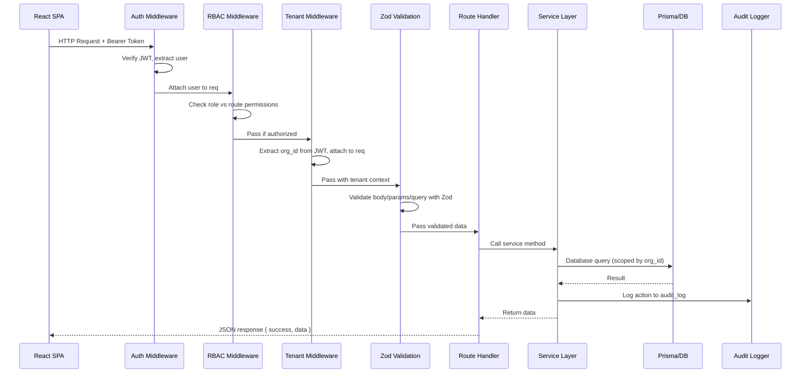
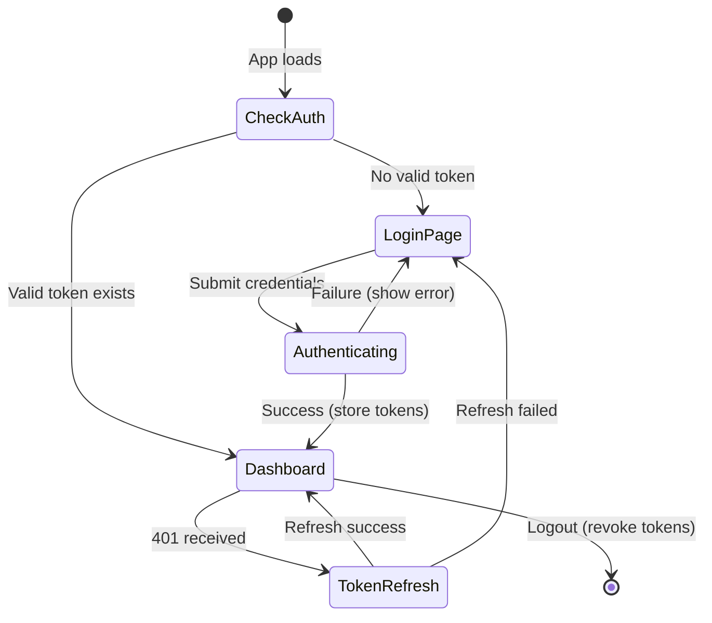
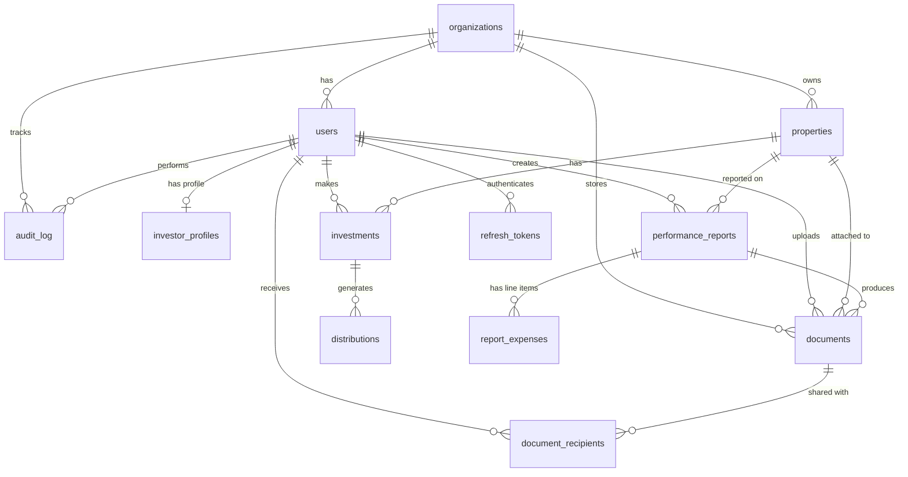

# Design Document — Sonno Homes Platform

## Overview

Sonno Homes is a full-stack investor portal for an Italian short-term rental property management company. It replaces the third-party Agora system with a custom-built solution serving two roles: Admins (management team) and Investors. The platform provides portfolio management, performance reporting, distribution tracking, document management, and dashboard analytics.

The system consists of:
- A **React 19 SPA** (Vite) as the frontend, currently containing hardcoded data that must be wired to real API calls
- A **Node.js + Express REST API** backend with JWT authentication, Zod validation, and Prisma ORM
- A **PostgreSQL 16** database with 12 tables, multi-tenancy via `org_id`, soft deletes, generated columns, and audit logging
- **AWS S3** for document storage with pre-signed URLs for secure upload/download

The design covers all 32 requirements: authentication, RBAC, CRUD for all entities (organizations, users, properties, investments, distributions, reports, documents), dashboard aggregations, CSV/PDF export, audit logging, and the full frontend integration.

## Architecture

### System Architecture Diagram

```mermaid
graph TB
    subgraph Frontend["Frontend (Vite + React 19 SPA)"]
        UI[React Components]
        Router[React Router]
        HttpClient[Axios HTTP Client]
        AuthStore[Auth State - Memory]
    end

    subgraph Backend["Backend (Node.js + Express)"]
        MW[Middleware Stack]
        AuthMW[Auth Middleware - JWT Verify]
        RBAC[RBAC Middleware]
        TenantMW[Tenant Scoping Middleware]
        ValMW[Zod Validation Middleware]
        
        subgraph Routes["Route Handlers"]
            AuthR[Auth Routes]
            UserR[User Routes]
            PropR[Property Routes]
            InvR[Investment Routes]
            DistR[Distribution Routes]
            RepR[Report Routes]
            DocR[Document Routes]
            DashR[Dashboard Routes]
            ExpR[Export Routes]
            AuditR[Audit Routes]
            OrgR[Organization Routes]
        end
        
        subgraph Services["Service Layer"]
            AuthS[Auth Service]
            UserS[User Service]
            PropS[Property Service]
            InvS[Investment Service]
            DistS[Distribution Service]
            RepS[Report Service]
            DocS[Document Service]
            DashS[Dashboard Service]
            ExpS[Export Service]
            AuditS[Audit Service]
            OrgS[Organization Service]
        end
    end

    subgraph Data["Data Layer"]
        Prisma[Prisma Client]
        PG[(PostgreSQL 16)]
        S3[(AWS S3)]
    end

    UI --> Router
    Router --> HttpClient
    HttpClient -->|Bearer JWT| MW
    MW --> AuthMW --> RBAC --> TenantMW --> ValMW --> Routes
    Routes --> Services
    Services --> Prisma --> PG
    Services --> S3
    AuthStore -.->|Access Token| HttpClient

```



### Request Flow



### Technology Stack

| Layer | Technology | Purpose |
|-------|-----------|---------|
| Frontend | Vite + React 19 | SPA with JSX, hooks, client-side routing |
| HTTP Client | Axios | Request interceptors for JWT attach + auto-refresh |
| Backend Runtime | Node.js 20+ | JavaScript runtime |
| Web Framework | Express 4 | HTTP routing, middleware pipeline |
| ORM | Prisma 5 | Type-safe DB access, migrations, soft-delete middleware |
| Database | PostgreSQL 16 | Relational storage with generated columns, JSONB, UUID |
| Authentication | JWT (jsonwebtoken) | 15-min access tokens, DB-stored refresh tokens |
| Password Hashing | bcrypt | Secure password storage |
| Validation | Zod | Runtime schema validation for all API inputs |
| File Storage | AWS S3 | Document storage with pre-signed URLs |
| PDF Generation | PDFKit or Puppeteer | Performance report PDF export |
| CSV Generation | json2csv | CSV export for investor/distribution/property data |

### Project Structure

```
sonno-homes/
├── src/                          # Frontend (React SPA)
│   ├── App.jsx                   # Main app (to be refactored into modules)
│   ├── api/                      # API client layer
│   │   ├── client.js             # Axios instance with interceptors
│   │   ├── auth.js               # Auth API calls
│   │   ├── users.js              # User/profile API calls
│   │   ├── properties.js         # Property API calls
│   │   ├── investments.js        # Investment API calls
│   │   ├── distributions.js      # Distribution API calls
│   │   ├── reports.js            # Report API calls
│   │   ├── documents.js          # Document API calls
│   │   ├── dashboard.js          # Dashboard API calls
│   │   └── exports.js            # Export API calls
│   ├── hooks/                    # Custom React hooks
│   │   ├── useAuth.js            # Auth state management
│   │   └── useApi.js             # Generic data fetching hook
│   └── contexts/
│       └── AuthContext.jsx        # Auth context provider
├── server/                       # Backend (Node.js + Express)
│   ├── index.js                  # Express app entry point
│   ├── config/
│   │   └── env.js                # Environment variable config
│   ├── middleware/
│   │   ├── auth.js               # JWT verification
│   │   ├── rbac.js               # Role-based access control
│   │   ├── tenant.js             # Multi-tenancy scoping
│   │   ├── validate.js           # Zod validation wrapper
│   │   └── errorHandler.js       # Global error handler
│   ├── routes/
│   │   ├── auth.routes.js
│   │   ├── user.routes.js
│   │   ├── property.routes.js
│   │   ├── investment.routes.js
│   │   ├── distribution.routes.js
│   │   ├── report.routes.js
│   │   ├── document.routes.js
│   │   ├── dashboard.routes.js
│   │   ├── export.routes.js
│   │   ├── audit.routes.js
│   │   └── organization.routes.js
│   ├── services/
│   │   ├── auth.service.js
│   │   ├── user.service.js
│   │   ├── property.service.js
│   │   ├── investment.service.js
│   │   ├── distribution.service.js
│   │   ├── report.service.js
│   │   ├── document.service.js
│   │   ├── dashboard.service.js
│   │   ├── export.service.js
│   │   ├── audit.service.js
│   │   └── organization.service.js
│   ├── schemas/                  # Zod validation schemas
│   │   ├── auth.schema.js
│   │   ├── user.schema.js
│   │   ├── property.schema.js
│   │   ├── investment.schema.js
│   │   ├── distribution.schema.js
│   │   ├── report.schema.js
│   │   ├── document.schema.js
│   │   └── organization.schema.js
│   └── utils/
│       ├── s3.js                 # S3 client + pre-signed URL helpers
│       ├── jwt.js                # Token generation/verification
│       ├── csv.js                # CSV generation helpers
│       ├── pdf.js                # PDF generation helpers
│       └── errors.js             # Custom error classes
├── prisma/
│   ├── schema.prisma             # Prisma schema (12 models, enums, relations)
│   ├── migrations/               # Version-controlled migrations
│   └── seed.js                   # Database seed script
├── package.json
├── .env                          # Environment variables
└── vite.config.js                # Vite config with API proxy
```

## Components and Interfaces

### Middleware Pipeline

All requests pass through a middleware chain in this order:

1. **Auth Middleware** (`server/middleware/auth.js`)
   - Extracts JWT from `Authorization: Bearer <token>` header
   - Verifies token signature and expiry using `jsonwebtoken`
   - Attaches decoded user (`{ id, email, role, org_id }`) to `req.user`
   - Skips for public routes: `/auth/login`, `/auth/refresh`, `/auth/forgot-password`, `/auth/reset-password`

2. **RBAC Middleware** (`server/middleware/rbac.js`)
   - Factory function: `requireRole(...roles)` returns middleware
   - Checks `req.user.role` against allowed roles for the route
   - Returns 403 if role not permitted
   - Admin-only routes (🔒) use `requireRole('admin')`

3. **Tenant Middleware** (`server/middleware/tenant.js`)
   - Reads `org_id` from `req.user` (set by auth middleware)
   - Attaches `req.orgId` for use in service queries
   - All database queries include `WHERE org_id = req.orgId`

4. **Validation Middleware** (`server/middleware/validate.js`)
   - Factory function: `validate(schema)` returns middleware
   - Validates `req.body`, `req.params`, and `req.query` against Zod schemas
   - Returns 400 with structured field-level errors on failure

5. **Error Handler** (`server/middleware/errorHandler.js`)
   - Global catch-all at the end of the middleware chain
   - Formats all errors into `{ success: false, error: { code, message, details } }`
   - Logs full error details server-side, returns generic message for 500s

### Service Layer Interfaces

Each service encapsulates business logic and database access for its domain. Services receive `orgId` and user context from the route handler.

#### Auth Service
```
login(email, password) → { accessToken, refreshToken }
refresh(refreshToken) → { accessToken, refreshToken }
logout(refreshToken) → void
register(orgId, userData) → User (without password_hash)
forgotPassword(email) → void (sends email)
resetPassword(token, newPassword) → void
getMe(userId) → User with profile
```

#### User Service
```
list(orgId, pagination) → { users[], total, page, pageSize }
getById(orgId, userId) → User with investor_profile
update(orgId, userId, data) → User
softDelete(orgId, userId) → void
getProfile(orgId, userId) → InvestorProfile
updateProfile(orgId, userId, data) → InvestorProfile
```

#### Property Service
```
create(orgId, data) → Property
list(orgId, role, investorId?) → Property[]
getById(orgId, propertyId) → Property
update(orgId, propertyId, data) → Property
softDelete(orgId, propertyId) → void
getInvestors(orgId, propertyId) → User[]
getReports(orgId, propertyId, role, investorId?) → Report[]
getDocuments(orgId, propertyId, role, investorId?) → Document[]
getDistributions(orgId, propertyId) → Distribution[]
```

#### Investment Service
```
create(orgId, data) → Investment
list(orgId, role, investorId?) → Investment[]
getById(orgId, investmentId) → Investment
update(orgId, investmentId, data) → Investment
softDelete(orgId, investmentId) → void
```

#### Distribution Service
```
create(orgId, data) → Distribution
batchCreate(orgId, period, investmentIds) → Distribution[]
list(orgId, role, investorId?) → Distribution[]
getById(orgId, distributionId) → Distribution
update(orgId, distributionId, data) → Distribution
getSummary(orgId, role, investorId?) → DistributionSummary
```

#### Report Service
```
create(orgId, adminId, data) → Report
list(orgId, role, investorId?) → Report[]
getById(orgId, reportId) → Report with expenses
update(orgId, reportId, data) → Report
publish(orgId, reportId) → Report
softDelete(orgId, reportId) → void
addExpense(orgId, reportId, data) → Expense
updateExpense(orgId, reportId, expenseId, data) → Expense
deleteExpense(orgId, reportId, expenseId) → void
listExpenses(orgId, reportId) → Expense[]
```

#### Document Service
```
create(orgId, uploaderId, data) → { document, uploadUrl }
list(orgId, role, investorId?) → Document[]
getById(orgId, documentId) → Document
getDownloadUrl(orgId, documentId) → { url }
update(orgId, documentId, data) → Document
softDelete(orgId, documentId) → void
share(orgId, documentId, investorIds) → void
trackView(documentId, investorId, type) → void
```

#### Dashboard Service
```
getAdminDashboard(orgId) → AdminKPIs
getCommitmentSummary(orgId) → CommitmentSummary
getContractExpiry(orgId) → ContractExpiry[]
getInvestorDashboard(orgId, investorId) → InvestorKPIs
getInvestorAllocation(orgId, investorId) → Allocation[]
getInvestorRoi(orgId, investorId) → RoiData[]
getRecoupEstimate(orgId, investorId) → RecoupEstimate
```

#### Export Service
```
exportInvestors(orgId) → CSVStream
exportDistributions(orgId) → CSVStream
exportProperties(orgId) → CSVStream
exportReport(orgId, reportId) → PDF/CSVStream
exportInvestorDistributions(orgId, investorId) → CSVStream
```

#### Audit Service
```
log(orgId, userId, action, entityType, entityId, metadata, ipAddress) → void
query(orgId, filters, pagination) → { entries[], total }
```

#### Organization Service
```
get(orgId) → Organization
update(orgId, data) → Organization
listTeam(orgId) → User[]
addTeamMember(orgId, data) → User
removeTeamMember(orgId, userId) → void
```

### Frontend API Client

The Axios HTTP client (`src/api/client.js`) handles:
- Base URL configuration (`/api/v1`)
- Automatic `Authorization: Bearer <token>` header attachment
- 401 response interception → automatic token refresh via `/auth/refresh`
- Queue pending requests during refresh to avoid race conditions
- Access token stored in memory (JS variable), refresh token in httpOnly cookie

### Frontend Auth Flow



## Data Models

The database consists of 12 tables managed via Prisma. The full SQL schema is defined in `docs/database-schema.sql` and the ER diagram in `docs/er-diagram.md`.

### Entity Relationship Diagram



### Table Summaries

#### organizations
Top-level tenant entity. All data is scoped by `org_id`. Contains company details and the `management_fee` percentage (default 0.20 = 20%) applied to performance reports.

#### users
Authentication and identity. Has `role` enum (`admin` | `investor`). Unique constraint on `(org_id, email)`. Soft-deletable. Links to `investor_profiles` for investor-specific data.

#### investor_profiles
Extended investor data: `occupation`, `city`, `country`, `notes`, `future_commitment`, `accredited`. One-to-one with `users` via `user_id`.

#### properties
Rental properties with financial metrics: `property_value`, `monthly_yield`, `occupancy_rate`, `noi`, `irr`. Status enum: `active`, `lease_renewal`, `inactive`, `sold`. Soft-deletable.

#### investments
Junction between investors and properties carrying financial details: `amount`, `equity_share`, `start_date`, `end_date`, `status`. Unique constraint on `(investor_id, property_id)`. Status enum: `active`, `matured`, `exited`, `pending`. `end_date` can be auto-computed as `start_date + contract_years`.

#### distributions
Periodic payments from property returns to investors, linked through investments. Fields: `period_start`, `period_end`, `amount`, `dist_type` (monthly/quarterly/annual/special), `status` (pending/paid/failed/cancelled), `paid_at`. Not soft-deletable — use status changes.

#### performance_reports
Monthly financial reports per property. Contains `nights_booked`, `nights_available`, `gross_revenue`, `total_expenses` (sum of line items). `gross_profit` and `net_profit` are PostgreSQL generated columns. Status: `draft` → `published` → `archived`. Unique constraint on `(property_id, period_start, period_end)`.

#### report_expenses
Flexible expense line items for reports. Fields: `category` (varchar, not enum — supports any category), `description`, `amount`, `sort_order`. Cascade-deleted with parent report.

#### documents
Files stored in S3. Links to `org_id`, optionally to `property_id` and `report_id`. Types: `contract`, `tax_k1`, `operating_agreement`, `statement`, `performance_report`, `schedule`, `policy`, `other`. Soft-deletable.

#### document_recipients
Many-to-many between documents and investors. Tracks `viewed_at` and `downloaded_at`. Unique constraint on `(document_id, investor_id)`.

#### audit_log
Immutable action log. Fields: `action` (e.g., `report.published`), `entity_type`, `entity_id`, `metadata` (JSONB), `ip_address`. No updates or deletes permitted.

#### refresh_tokens
JWT refresh tokens stored as hashes. Fields: `token_hash`, `expires_at`, `revoked_at`. Cascade-deleted with parent user.

### Enums

| Enum | Values |
|------|--------|
| `user_role` | `admin`, `investor` |
| `property_status` | `active`, `lease_renewal`, `inactive`, `sold` |
| `investment_status` | `active`, `matured`, `exited`, `pending` |
| `distribution_type` | `monthly`, `quarterly`, `annual`, `special` |
| `distribution_status` | `pending`, `paid`, `failed`, `cancelled` |
| `report_status` | `draft`, `published`, `archived` |
| `document_type` | `contract`, `tax_k1`, `operating_agreement`, `statement`, `performance_report`, `schedule`, `policy`, `other` |

### Unique Constraints

| Constraint | Table | Columns | Purpose |
|-----------|-------|---------|---------|
| `uq_users_email_org` | users | `(org_id, email)` | One email per org |
| `uq_investment` | investments | `(investor_id, property_id)` | One investment per investor per property |
| `uq_report_property_period` | performance_reports | `(property_id, period_start, period_end)` | One report per property per period |
| `uq_doc_recipient` | document_recipients | `(document_id, investor_id)` | One recipient row per doc per investor |

### Indexes

All foreign keys are indexed. Additional composite indexes:
- `distributions(period_start, period_end)` — date-range queries
- `audit_log(entity_type, entity_id)` — entity history lookups
- `audit_log(created_at)` — time-range queries
- `users(email)` — login lookups
- `users(role)` — role-based filtering

### Soft Delete Strategy

Applied to: `organizations`, `users`, `properties`, `investments`, `performance_reports`, `documents`.
Not applied to: `distributions` (use status changes), `audit_log` (immutable), `report_expenses` (cascade with report), `document_recipients` (cascade with document), `refresh_tokens` (cascade with user), `investor_profiles` (cascade with user).

Prisma middleware adds `WHERE deleted_at IS NULL` to all default queries on soft-deletable models.

### Computed Fields (API/Frontend Responsibility)

These values are derived at query time, not stored:
- **Total invested per investor**: `SUM(investments.amount) WHERE investor_id = X`
- **Total distributed per investor**: `SUM(distributions.amount) WHERE investment.investor_id = X AND status = 'paid'`
- **ROI %**: `total_distributed / total_invested * 100`
- **Months active/remaining**: derived from `investments.start_date` and `properties.contract_years`
- **Time to recoup**: `(total_invested - total_distributed) / avg_monthly_distribution`
- **Allocation %**: `investment.amount / total_invested * 100` per property
- **Occupancy rate** (per report): `nights_booked / nights_available * 100`
