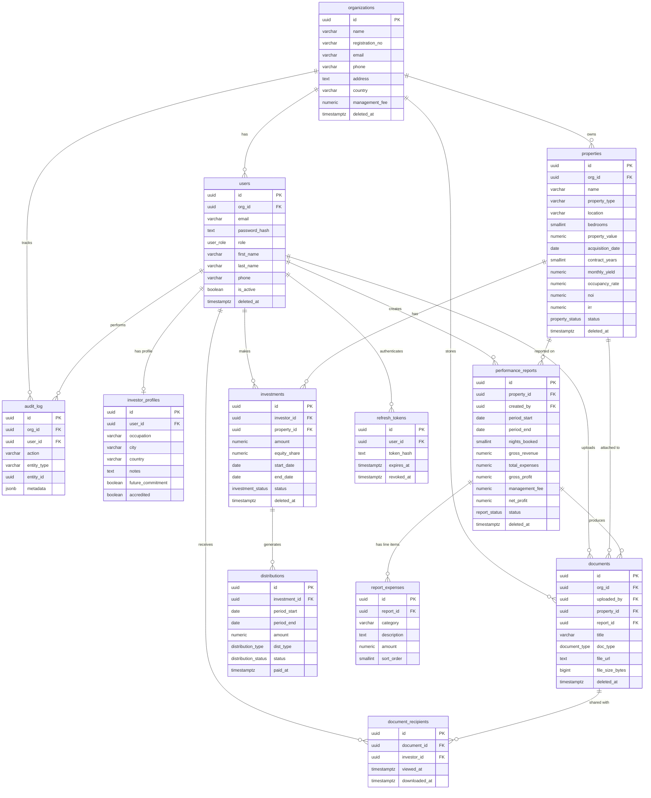

# Sonno Homes — ER Diagram

```mermaid
erDiagram
    organizations ||--o{ users : "has"
    organizations ||--o{ properties : "owns"
    organizations ||--o{ documents : "stores"
    organizations ||--o{ audit_log : "tracks"

    users ||--o| investor_profiles : "has profile"
    users ||--o{ investments : "makes"
    users ||--o{ performance_reports : "creates"
    users ||--o{ documents : "uploads"
    users ||--o{ document_recipients : "receives"
    users ||--o{ refresh_tokens : "authenticates"
    users ||--o{ audit_log : "performs"

    properties ||--o{ investments : "has"
    properties ||--o{ performance_reports : "reported on"
    properties ||--o{ documents : "attached to"

    investments ||--o{ distributions : "generates"

    performance_reports ||--o{ report_expenses : "has line items"
    performance_reports ||--o{ documents : "produces"

    documents ||--o{ document_recipients : "shared with"

    organizations {
        uuid id PK
        varchar name
        varchar registration_no
        varchar email
        varchar phone
        text address
        varchar country
        numeric management_fee
        timestamptz deleted_at
    }

    users {
        uuid id PK
        uuid org_id FK
        varchar email
        text password_hash
        user_role role
        varchar first_name
        varchar last_name
        varchar phone
        boolean is_active
        timestamptz deleted_at
    }

    investor_profiles {
        uuid id PK
        uuid user_id FK
        varchar occupation
        varchar city
        varchar country
        text notes
        boolean future_commitment
        boolean accredited
    }

    properties {
        uuid id PK
        uuid org_id FK
        varchar name
        varchar property_type
        varchar location
        smallint bedrooms
        numeric property_value
        date acquisition_date
        smallint contract_years
        numeric monthly_yield
        numeric occupancy_rate
        numeric noi
        numeric irr
        property_status status
        timestamptz deleted_at
    }

    investments {
        uuid id PK
        uuid investor_id FK
        uuid property_id FK
        numeric amount
        numeric equity_share
        date start_date
        date end_date
        investment_status status
        timestamptz deleted_at
    }

    distributions {
        uuid id PK
        uuid investment_id FK
        date period_start
        date period_end
        numeric amount
        distribution_type dist_type
        distribution_status status
        timestamptz paid_at
    }

    performance_reports {
        uuid id PK
        uuid property_id FK
        uuid created_by FK
        date period_start
        date period_end
        smallint nights_booked
        numeric gross_revenue
        numeric total_expenses
        numeric gross_profit
        numeric management_fee
        numeric net_profit
        report_status status
        timestamptz deleted_at
    }

    report_expenses {
        uuid id PK
        uuid report_id FK
        varchar category
        text description
        numeric amount
        smallint sort_order
    }

    documents {
        uuid id PK
        uuid org_id FK
        uuid uploaded_by FK
        uuid property_id FK
        uuid report_id FK
        varchar title
        document_type doc_type
        text file_url
        bigint file_size_bytes
        timestamptz deleted_at
    }

    document_recipients {
        uuid id PK
        uuid document_id FK
        uuid investor_id FK
        timestamptz viewed_at
        timestamptz downloaded_at
    }

    audit_log {
        uuid id PK
        uuid org_id FK
        uuid user_id FK
        varchar action
        varchar entity_type
        uuid entity_id
        jsonb metadata
    }

    refresh_tokens {
        uuid id PK
        uuid user_id FK
        text token_hash
        timestamptz expires_at
        timestamptz revoked_at
    }
```
